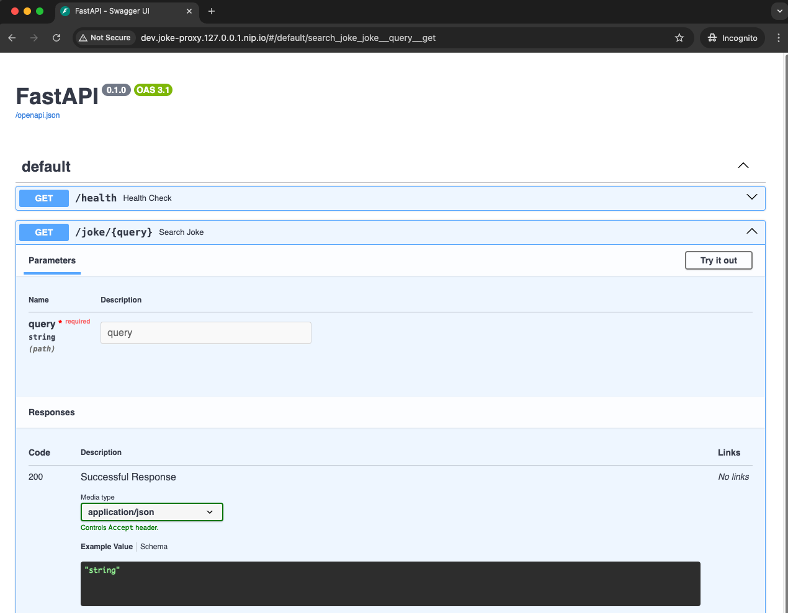

# Joke API Proxy Service 🎭

[](https://python.org)
[](https://fastapi.tiangolo.com)
[](https://docker.com)
[](https://kubernetes.io)
[](https://kustomize.io)
[](https://kind.sigs.k8s.io)
[](LICENSE)

*In terms of test task I was asked to create a tiny proxy service with connection to the external API and MongoDB,
containerized using Docker and ready for Kubernetes deployment.*

## API Features ✨
- 🔍 Search jokes by keyword
- 📊 MongoDB persistence for retrieved jokes
- 🐳 Full Docker support with docker-compose
- 🔒 Environment-based configuration

## Kubernetes Features 🛠️
- 🐳 Lightweight local Kubernetes with Kind
- 🎛️ Multi-environment configs with Kustomize
- 🔒 Secure secret management & rotation
- 🔄 CronJob for credential rotation
- 🔄 Zero-downtime credential updates
- 🔌 Ingress-controlled API exposure

## Key DevOps Concepts Implemented 🔑
1. **Containerization**: Multi-service Docker setup
2. **Secret Management**: Environment variables for credentials
3. **Dependency Management**: Poetry for Python packages
4. **Logging/Monitoring**: MongoDB integration for request tracking
5. **CI/CD Ready**: Structure prepared for future pipeline integration

---

## Getting Started 🚦

## Docker Compose Setup 🐳

### Prerequisites
- Docker 🐳

### Clone the repository

```bash
git clone https://github.com/vliubko/joke-proxy
cd joke-proxy
```

### Start services locally

```bash
docker-compose up --build
```

### Access the API at `http://localhost:8000`


## Database Setup 🍃
MongoDB instance with:
- Automatic initialization
- Persistent storage

## Access MongoDB shell
```bash
docker exec -it mongo mongosh
```


## API Documentation 📚
Access the Swagger UI at `http://localhost:8000` (using Docker) or your environment-specific domain (using Kubernetes)

### Available Endpoints
- `GET /health` - Service health check
- `GET /joke/{query}` - Search for jokes



---

## Kubernetes Deployment 🚀

### Prerequisites
- Docker 🐳
- Kind ⛵️ (`brew install kind`)
- Kubectl ▶️ (`brew install kubectl`)
- Kustomize 🛠️ (`brew install kustomize`)
- Homebrew 🍺 (https://brew.sh)

## 1. Create a local cluster 🌐

Create a local cluster with the following command:
```bash
kind create cluster --name joke-cluster --config kind-config.yaml
```
Load a local application image into the cluster:
```bash
docker-compose build && kind load docker-image joke-proxy:latest --name joke-cluster
```

### Verify Cluster

```bash
kubectl cluster-info --context kind-joke-cluster
```

---

## 2. Cluster Setup 🌐

### Deploy base infrastructure (Namespaces, Ingress, MongoDB)

```bash
kubectl apply -f k8s/cluster-setup
```

Verify that MongoDB and Ingress Nginx Controller are running and accessible:

```bash
kubectl rollout status statefulset/mongo -n mongodb
kubectl rollout status deployment/ingress-nginx-controller -n ingress-nginx
```

---

## 3. Kustomize Multi-Environment Setup 🚀

### Directory Structure:
```bash
app/
├── base
│   ├── configmap.yaml
│   ├── cronjob.yaml
│   ├── deployment.yaml
│   ├── ingress.yaml
│   ├── kustomization.yaml
│   ├── mongo-user-creation-job.yaml
│   ├── secret.yaml
│   └── service.yaml
└── overlays
    ├── dev
    │   └── kustomization.yaml
    ├── prod
    │   └── kustomization.yaml
    └── staging
        └── kustomization.yaml
```

### Deploy environment-specific configuration:
#### Dev
```bash
kubectl apply -k k8s/app/overlays/dev
```
#### Staging
```bash
kubectl apply -k k8s/app/overlays/staging
```
#### Prod
```bash
kubectl apply -k k8s/app/overlays/prod
```
---

## Architecture Overview 🏗️

### Environment-Specific Configurations
- **Development**: Single replica, minimal resources
- **Staging**: Dual replicas, moderate resources
- **Production**: Triple replicas, high availability

### Security Features
- Secure MongoDB credentials management
- Automatic credential rotation (every minute)
- Zero-downtime pod updates during rotation

### Network Configuration
- Ingress-controlled access
- Service-based pod communication
- Environment-specific domains

## Cleanup 🧹
```bash
kind delete cluster --name joke-cluster
```
